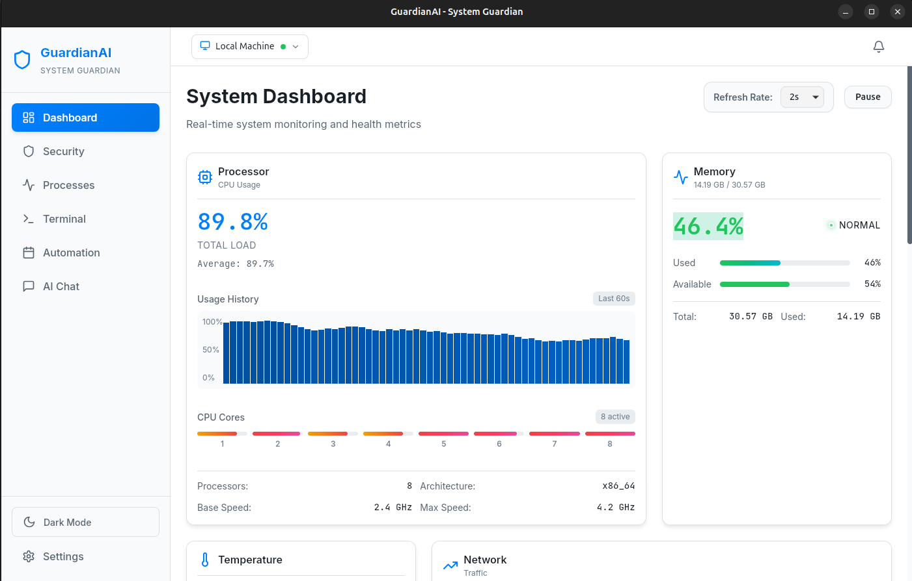
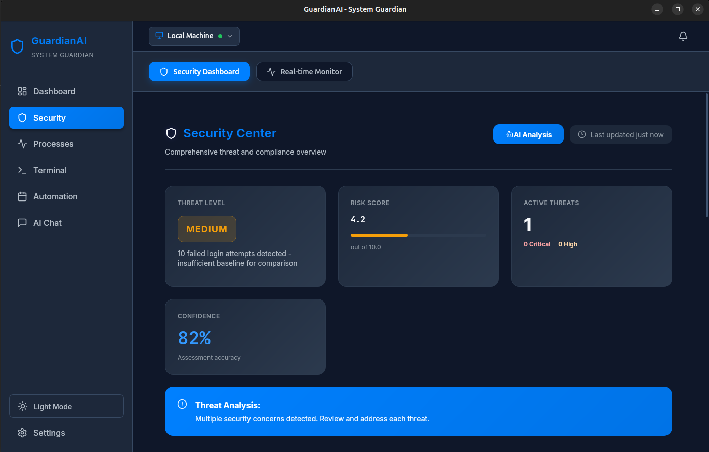
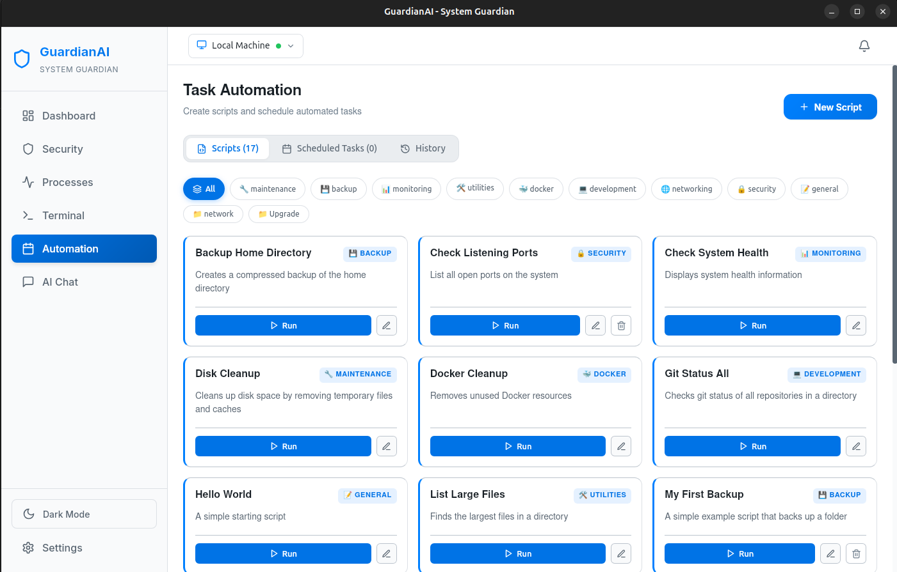
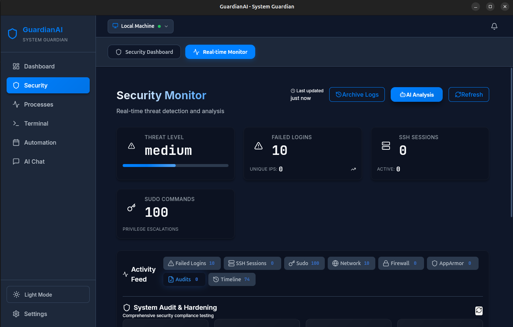
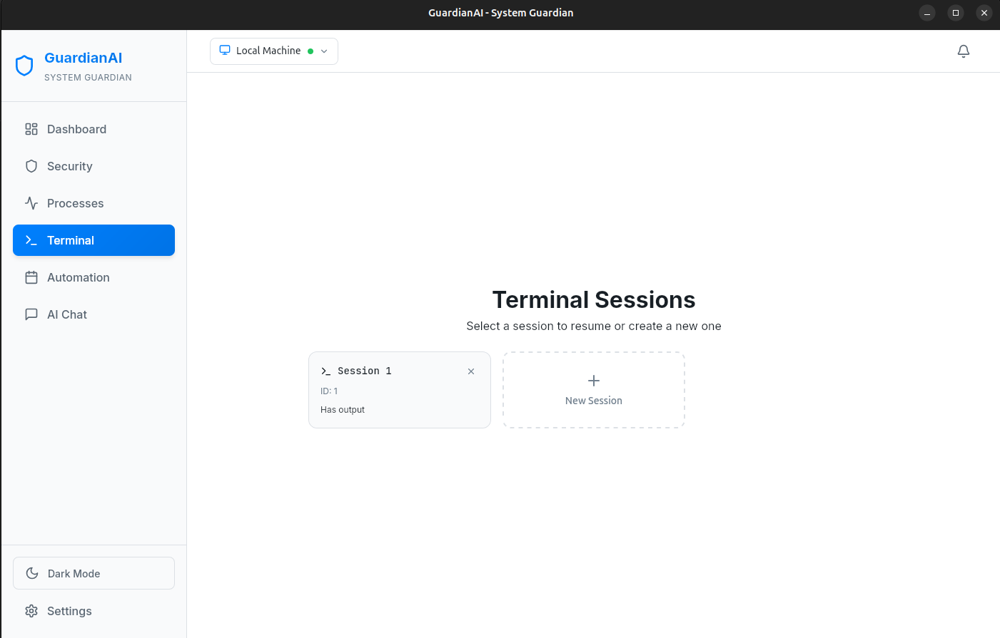

## 🎯 What is GuardianAI?

GuardianAI is a **Tauri-based desktop application** that transforms Linux system administration through the power of local AI. It combines a beautiful, modern UI with intelligent automation to help you:

- 🤖 **Translate natural language to Linux commands** - No need to remember complex syntax
- 🔒 **Monitor system security in real-time** - Detect threats before they become problems
- 📊 **Visualize system performance** - Watch CPU, RAM, disk, and network live
- ⚙️ **Manage processes and services** - Understand and control what's running
- 🔐 **Maintain privacy** - Uses local AI models (no cloud required)
- 🎨 **Enjoy a beautiful interface** - Modern dark theme with smooth animations

**Perfect for:** System administrators, DevOps engineers, Linux enthusiasts, and anyone managing Linux servers.

---

## ✨ Key Features

### 🤖 AI Command Assistant

- **Natural Language to Command**: Say "Show disk usage" and get `df -h` with explanation
- **Safety First**: Every command is explained before execution
- **Smart Suggestions**: Context-aware recommendations for common tasks
- **Command History**: Search and reuse previous commands with AI insights

### 🔒 Security Monitoring

- **Real-time Threat Detection**: Monitor unusual processes and network activity
- **Log Analysis**: AI analyzes system logs for anomalies
- **Failed Login Tracking**: Stay alert to suspicious authentication attempts
- **Security Dashboard**: Comprehensive view of your system's security posture

### 📊 System Dashboard

- **Live Metrics**: CPU, RAM, Disk, and Network usage with beautiful charts
- **Performance Insights**: AI-generated optimization suggestions
- **System Health**: Quick overview of critical components
- **Smart Alerts**: Get notified before issues become critical

### ⚙️ Process & Service Manager

- **Process Monitoring**: View all running processes with resource usage
- **Service Control**: Manage system services with ease
- **Anomaly Detection**: AI identifies suspicious process behavior
- **Resource Analysis**: Find and fix resource-hogging applications

### 🤖 Task Automation

- Script management and scheduling
- AI-assisted script generation
- Backup automation
- Maintenance routines

### 💬 AI Chat Interface

- **System Q&A**: "Why is my system slow?" gets intelligent answers
- **Troubleshooting**: Step-by-step problem resolution
- **Context-Aware**: AI understands your system's current state
- **Learning**: Improves suggestions based on your usage

---

## 🚀 Installation

GuardianAI is distributed in multiple formats to suit your preference.

### 📦 AppImage (Universal Linux)

Ideal for quick use without installation.

1. Download the `.AppImage` from the [Releases](https://github.com/mskDev0092/Linux-GuardianAI/releases) page.
2. Make it executable:
   ```bash
   chmod +x GuardianAI_0.0.8_amd64.AppImage
   ```
3. Run it:
   ```bash
   ./GuardianAI_0.0.8_amd64.AppImage
   ```

### 🛠️ Debian/Ubuntu (.deb)

Recommended for deep system integration.

1. Download the `.deb` package from the [Releases](https://github.com/mskDev0092/Linux-GuardianAI/releases) page.
2. Install using `apt` (handles dependencies automatically):
   ```bash
   sudo apt install ./GuardianAI_0.0.8_amd64.deb
   ```
3. Alternatively, use `dpkg`:
   ```bash
   sudo dpkg -i GuardianAI_0.0.8_amd64.deb
   sudo apt install -f # Fix any missing dependencies
   ```

---

## ⚙️ Configuration

### Setting Up Local AI

GuardianAI works best with local AI models for maximum privacy and speed.

#### Option 1: LMStudio (Recommended)

1. Download [LMStudio](https://lmstudio.ai)
2. Load a model (e.g., Qwen-12B)
3. Start the server (default: `http://localhost:1234`)
4. GuardianAI will auto-detect it

#### Option 2: Jan.ai

1. Download [Jan.ai](https://jan.ai)
2. Start a local model server
3. Configure the endpoint in GuardianAI settings

#### Option 3: Cloud API (Fallback)

If local AI isn't available, you can use:

- **Groq API** (Blazing fast inference)
- OpenAI API
- Anthropic Claude
- Other OpenAI-compatible APIs

**Quick Setup with Groq:**
Set your Groq API key and use the following endpoint in settings: `https://api.groq.com/openai/v1`

Configure your keys and preferred provider in the application settings.

## 📸 Showcase

### 📊 System Dashboard

Monitor your system's vital signs at a glance with real-time metrics and beautiful charts.

_Real-time monitoring of CPU, Memory, Disk, and Temperature._

### 🛡️ Security & Hardening

Comprehensive view of your system's security posture with AI-driven audit analysis.

_Lynis audits and AppArmor profile management._

### 🤖 AI-Powered Assistant

Get instant answers and commands with natural language conversation powered by local AI.

_AI explaining scripts and suggesting system fixes._

### ⚙️ Automation & Scripting

AI-assisted script generation, backup automation, and maintenance routines.

_Manage and schedule complex system tasks with ease._

### 🔍 Real-time Monitoring

Deep dive into processes and network activity with live updates.

_Track every process and network connection in real-time._

### 💻 Advanced Terminal & Settings

Full control over the AI engine and system integration.

_Customizable AI backends and integrated terminal access._

---
